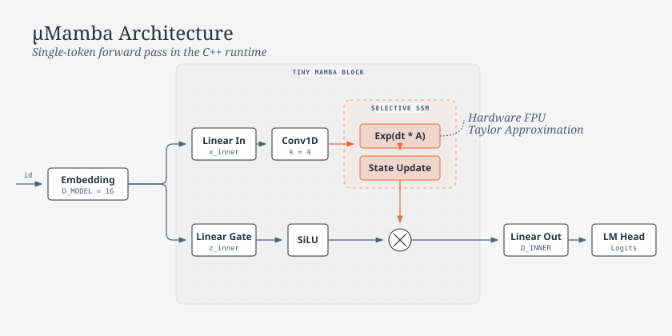

<div align="center">
  <h1>µMamba</h1>
  <p><b>A Tiny State-Space Language Model Runtime for Resource-Constrained Microcontrollers</b></p>
</div>

<p align="center">
  
  
  
  
</p>

## 📖 Overview

**µMamba** is a hyper-optimized, zero-allocation implementation of the Selective State-Space Model (Mamba) architecture, built from scratch to run inference directly on 32-bit microcontrollers like the Arduino UNO R4 Minima. 

Unlike Transformers, which consume quadratic memory per token, Mamba's $O(1)$ state footprint allows complex language generation to occur within incredibly tight 32KB SRAM limits.

### ✨ Features
- **Zero Heap Allocation:** Pure static C++ templates. No `malloc`, no `free`, zero memory fragmentation.
- **Hardware FPU Accelerated:** Leverages the Cortex-M4's single-precision floating-point unit for blazing fast matrix math (up to 170 tokens/sec).
- **End-to-End Pipeline:** Includes a built-in character-level tokenizer, embeddings, local 1D convolutions, Selective SSM core, and temperature/argmax sampling.
- **PyTorch Training Bridge:** Train your model on a PC using standard PyTorch, then export the learned weights directly to a C++ header file for embedded flashing.

---

## 🏗️ Architecture

The model is built on a streamlined, microcontroller-friendly interpretation of the Mamba architecture. 

*Editorial visualization of the µMamba Inference Pipeline:*



---

## ⚡ Hardware Constraints & Memory

The baseline configuration is highly optimized for the **Arduino UNO R4 Minima**:

| Parameter | Value | Details |
| :--- | :--- | :--- |
| `VOCAB_SIZE` | 64 | Trimmed character set (a-z, A-Z, 0-9, \n, space) |
| `D_MODEL` | 16 | Token embedding dimension |
| `D_INNER` | 16 | Expanded convolution and SSM dimension |
| `D_STATE` | 8 | Discretized state tracking per channel |

**Memory Footprint on Cortex-M4:**
* **Flash (PROGMEM):** ~75 KB (Includes code + parameters) out of 256 KB.
* **SRAM:** ~6.2 KB (Includes static buffers and allocations) out of 32 KB.

---

## 🚀 Getting Started

### 1. Arduino Dependencies
Ensure you have the `arduino-cli` installed along with the Renesas core:
```bash
arduino-cli core update-index
arduino-cli core install arduino:renesas_uno
```

*Note: On Linux, ensure your user is in the `uucp` and `dialout` groups, and that you have `udev` rules configured for DFU bootloader access (Vendor `2341`, Product `0069`).*

### 2. Flashing the Model
Simply compile and upload the `umamba.ino` sketch:
```bash
arduino-cli compile --fqbn arduino:renesas_uno:minima firmware/umamba
arduino-cli upload --fqbn arduino:renesas_uno:minima --port /dev/ttyACM0 firmware/umamba
```

### 3. Usage & Serial Commands
Open a Serial Monitor at **115200 baud** and interact with the model:
```bash
arduino-cli monitor -p /dev/ttyACM0 -c baudrate=115200
```
**Available Commands:**
* `prompt <text>`: Generates text using the SSM.
* `benchmark`: Profiles the MCU's float32 capabilities (yields ~170 tokens/sec on Cortex-M4).
* `memory`: Prints an exact byte-level breakdown of the active memory footprint.
* `reset`: Flushes the contextual state buffers.

---

## 🧠 Training Workflow

Microcontrollers are for inference, not training. µMamba includes a 1-to-1 matching Python/PyTorch implementation for desktop training.

1. **Train the Model:** Edit `tools/train.py` to ingest your preferred dataset (like Tiny Shakespeare or command logs).
   ```bash
   cd tools
   python train.py
   ```
2. **Export:** The script automatically extracts the PyTorch tensors and writes them as C++ PROGMEM matrices into `src/weights.h`.
3. **Deploy:** Recompile the Arduino sketch to bake the new "brain" directly into the flash memory.

---

*Built for embedded engineers pushing the limits of the State-Space revolution.*
